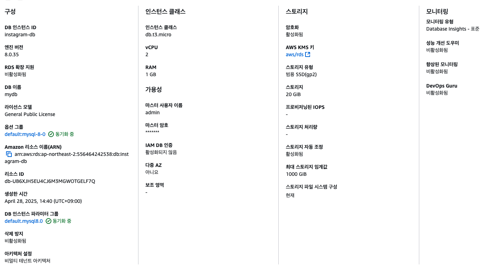

## AWS EC2에서 Spring Boot / Redis 활용

### ✅ RDS 설정


[추가 작업]
- 보안 그룹 인바운드 규칙에 3306 포트 추가


### ✅ EC2 설정

인스턴스 유형 `t3a.small` 선택

[추가 작업]
- 보안 그룹 인바운드 규칙에 8080 포트 추가


### ✅ EC2에 Redis 설치

1. Redis 설치
```shell
$ sudo apt update
$ sudo apt install redis
```

2. Redis 설치 확인
```shell
$ redis-cli
127.0.0.1:6379> ping
PONG
```

### ✅ EC2에 Spring Boot 프로젝트 셋팅하기

1. JDK 설치
```shell
$ sudo apt install openjdk-21-jdk
```

2. JDK 설치 확인
```shell
ubuntu@ip-172-31-32-90:~/inflearn-redis/redis-in-spring$ java --version
openjdk 21.0.6 2025-01-21
OpenJDK Runtime Environment (build 21.0.6+7-Ubuntu-124.04.1)
OpenJDK 64-Bit Server VM (build 21.0.6+7-Ubuntu-124.04.1, mixed mode, sharing)
```

3. Spring Boot 프로젝트에서 application.yml 정보 수정하기
   - AWS RDS 정보 추가, profile 추가
   - RDS 주소는 파라미터로 전달하여 노출되지 않도록 함, 가능하면 username, password도 노출되지 않도록 하는 것이 좋으나 학습이기 때문에 이대로 진행
```yaml
---
# prod 환경
spring:
  config:
    activate:
      on-profile: prod
  datasource:
    url: jdbc:mysql://${rdsAddress}:3306/mydb
    username: admin
    password: password
```

4. Git Clone
```shell
$ git clone {Github Repository 주소}
$ cd {프로젝트 경로}
```

5. 실행하기
```shell
# 스프링 프로젝트 경로로 들어가서 아래 명령어 실행
$ ./gradlew clean build -x test 
$ cd build/libs
$ java -jar -Dspring.profiles.active=prod -DrdsAddresss={RDS 엔드포인트} {빌드된 jar 파일명}
```

### ✅ RDS에 더미데이터 넣기

1. **DB GUI 툴로 RDS에 접속하기**
2. **더미 데이터 넣어주는 SQL문 실행시키기**
```sql
-- 높은 재귀(반복) 횟수를 허용하도록 설정
-- (아래에서 생성할 더미 데이터의 개수와 맞춰서 작성하면 된다.)
SET SESSION cte_max_recursion_depth = 1000000; 

-- boards 테이블에 더미 데이터 삽입
INSERT INTO boards (title, content, created_at)
WITH RECURSIVE cte (n) AS
(
  SELECT 1
  UNION ALL
  SELECT n + 1 FROM cte WHERE n < 1000000 -- 생성하고 싶은 더미 데이터의 개수
)
SELECT
    CONCAT('Title', LPAD(n, 7, '0')) AS title,  -- 'Title' 다음에 7자리 숫자로 구성된 제목 생성
    CONCAT('Content', LPAD(n, 7, '0')) AS content,  -- 'Content' 다음에 7자리 숫자로 구성된 내용 생성
    TIMESTAMP(DATE_SUB(NOW(), INTERVAL FLOOR(RAND() * 3650 + 1) DAY) + INTERVAL FLOOR(RAND() * 86400) SECOND) AS created_at -- 최근 10년 내의 임의의 날짜와 시간 생성
FROM cte;
```